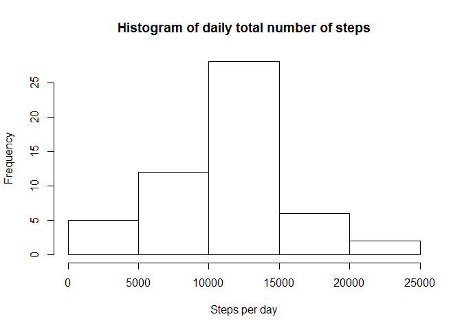
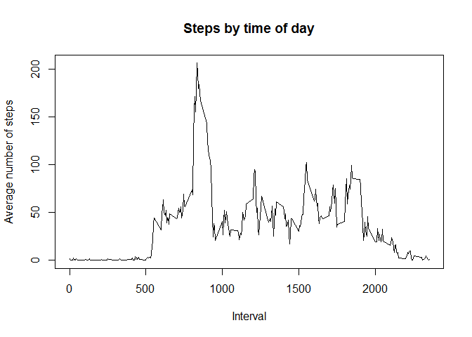
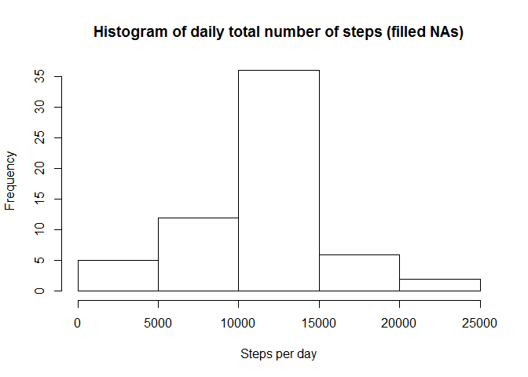
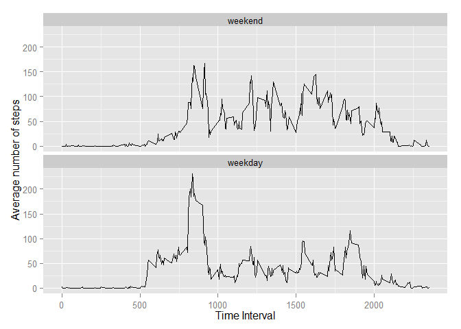

# Reproducible Research: Peer Assessment 1
Forked and Cloned into 
C:/Users/Rachael/datasciencecoursera/RepData_PeerAssessment1/PA1_template.Rmd
do not change the filename, because it is going to be pushed back to GitHub.
Note that the cloned directory includes the data file, so there is no need to do a separate download for it.
The zipped file is 53kb.  After unzipping, it is 343 kb.

## Loading and preprocessing the data


```r
unzip("C:/Users/Rachael/datasciencecoursera/RepData_PeerAssessment1/activity.zip", exdir = "C:/Users/Rachael/datasciencecoursera/RepData_PeerAssessment1")
activity <- read.csv("C:/Users/Rachael/datasciencecoursera/RepData_PeerAssessment1/activity.csv")
```


```
## [1] "steps"    "date"     "interval"
```

```
## 'data.frame':	17568 obs. of  3 variables:
##  $ steps   : int  NA NA NA NA NA NA NA NA NA NA ...
##  $ date    : Factor w/ 61 levels "2012-10-01","2012-10-02",..: 1 1 1 1 1 1 1 1 1 1 ...
##  $ interval: int  0 5 10 15 20 25 30 35 40 45 ...
```

```
##   steps       date interval
## 1    NA 2012-10-01        0
## 2    NA 2012-10-01        5
## 3    NA 2012-10-01       10
## 4    NA 2012-10-01       15
## 5    NA 2012-10-01       20
## 6    NA 2012-10-01       25
```

```
##    Min. 1st Qu.  Median    Mean 3rd Qu.    Max.    NA's 
##    0.00    0.00    0.00   37.38   12.00  806.00    2304
```

```
## 2012-10-01 2012-10-02 2012-10-03 2012-10-04 2012-10-05 2012-10-06 
##        288        288        288        288        288        288 
## 2012-10-07 2012-10-08 2012-10-09 2012-10-10 2012-10-11 2012-10-12 
##        288        288        288        288        288        288 
## 2012-10-13 2012-10-14 2012-10-15 2012-10-16 2012-10-17 2012-10-18 
##        288        288        288        288        288        288 
## 2012-10-19 2012-10-20 2012-10-21 2012-10-22 2012-10-23 2012-10-24 
##        288        288        288        288        288        288 
## 2012-10-25 2012-10-26 2012-10-27 2012-10-28 2012-10-29 2012-10-30 
##        288        288        288        288        288        288 
## 2012-10-31 2012-11-01 2012-11-02 2012-11-03 2012-11-04 2012-11-05 
##        288        288        288        288        288        288 
## 2012-11-06 2012-11-07 2012-11-08 2012-11-09 2012-11-10 2012-11-11 
##        288        288        288        288        288        288 
## 2012-11-12 2012-11-13 2012-11-14 2012-11-15 2012-11-16 2012-11-17 
##        288        288        288        288        288        288 
## 2012-11-18 2012-11-19 2012-11-20 2012-11-21 2012-11-22 2012-11-23 
##        288        288        288        288        288        288 
## 2012-11-24 2012-11-25 2012-11-26 2012-11-27 2012-11-28 2012-11-29 
##        288        288        288        288        288        288 
## 2012-11-30 
##        288
```

```
##    Min. 1st Qu.  Median    Mean 3rd Qu.    Max. 
##     0.0   588.8  1178.0  1178.0  1766.0  2355.0
```

## What is mean total number of steps taken per day?


```r
library(reshape2)
# note that you can't melt a POSIXlt column (so do this step before converting)
meltactivity <- melt(activity, id.vars="date", measure.vars="steps",
                     na.rm=FALSE)
castactivity <- dcast(meltactivity, date ~ variable, sum)
hist(castactivity$steps, main = "Histogram of daily total number of steps",
     xlab = "Steps per day")
```

 

```r
summary(castactivity)
```

```
##          date        steps      
##  2012-10-01: 1   Min.   :   41  
##  2012-10-02: 1   1st Qu.: 8841  
##  2012-10-03: 1   Median :10765  
##  2012-10-04: 1   Mean   :10766  
##  2012-10-05: 1   3rd Qu.:13294  
##  2012-10-06: 1   Max.   :21194  
##  (Other)   :55   NA's   :8
```

From the output of the summary command, we can see that 
Mean   = 10766
Median = 10765


## What is the average daily activity pattern?

For this section, we need to group the steps data by the intervals, and take the means. 
I decided to ignore the NA values, assuming that they would affect all the time intervals by approximately the same amounts, and we are interested in comparative values.


```r
meanstepsperint <- aggregate(steps ~ interval, data = activity, FUN = mean)
plot(meanstepsperint, type="l", main = "Steps by time of day",
     xlab = "Interval", ylab = "Average number of steps")
```

 

From the graph it looks like the max number of steps occurs at around 8am.
(Does the wearer run in the mornings?)


```r
maxlocation <- which.max(meanstepsperint$steps)
print(maxlocation)
```

```
## [1] 104
```

```r
intervalwithmaxsteps <- meanstepsperint$interval[maxlocation]
print(intervalwithmaxsteps)
```

```
## [1] 835
```

```r
maxnumberofsteps <- meanstepsperint$steps[maxlocation]
print(maxnumberofsteps)
```

```
## [1] 206.1698
```

206 steps in the 5-minute interval around 8:35.
206 steps in 300 seconds.   Could be a run on some mornings (not all), or just walking to work on many mornings.


## Imputing missing values

First, I had a look at where the missing values might be.
For example, the first day is all NA values in the steps column.
(Using the daily mean for that day would not help).


```r
narows <- sum(is.na(activity))
print(narows)
```

```
## [1] 2304
```

```r
nasteps <- sum(is.na(activity$steps))
print(nasteps)
```

```
## [1] 2304
```

```r
nainterval <- sum(is.na(activity$interval))
print(nainterval)
```

```
## [1] 0
```

```r
nadate <- sum(is.na(activity$date))
print(nadate)
```

```
## [1] 0
```

There are 2304 rows with NA values.

All of these have the NA values in the steps column.

I decided to use the mean values of each interval (as calculated above in meanstepsperint$steps) to fill in the NA values.

The NA values are at is.na(activity$steps)


```r
tempactivity <- activity
tempactivity$meansteps <- meanstepsperint$steps
# note that this will be recycled to cover every day
# and this should be OK because we know that each date has 288 interval values
# (from summary(activity))
for (i in 1:nrow(tempactivity)) {
    if (is.na(tempactivity[i, "steps"])) {
        tempactivity$filledsteps[i] <- tempactivity[i, "meansteps"]
    }
    else {
        tempactivity$filledsteps[i] <- tempactivity[i, "steps"]
    }
}

filledactivity <- data.frame (steps = tempactivity$filledsteps,
                              date = tempactivity$date,
                              interval = tempactivity$interval)

meltfilledactivity <- melt(filledactivity, id.vars="date", measure.vars="steps",
                     na.rm=FALSE)
castfilledactivity <- dcast(meltfilledactivity, date ~ variable, sum)
hist(castfilledactivity$steps,
     main = "Histogram of daily total number of steps (filled NAs)",
     xlab = "Steps per day")
```

 

```r
summary(castfilledactivity)
```

```
##          date        steps      
##  2012-10-01: 1   Min.   :   41  
##  2012-10-02: 1   1st Qu.: 9819  
##  2012-10-03: 1   Median :10766  
##  2012-10-04: 1   Mean   :10766  
##  2012-10-05: 1   3rd Qu.:12811  
##  2012-10-06: 1   Max.   :21194  
##  (Other)   :55
```
From the output of the summary command, we can see that 
Mean   = 10766
Median = 10766

This is almost the same as the values for the original data.
The median value has increased very slightly (by 1), and the mean value has apparently stayed the same. (I think it must have increased slightly - I just added a load of steps - but by less than 1.)

The thing that has changed is the Frequency.   That is, more days now have mean values that are in the range 10000 - 15000 steps per day.  Looking at the plots, it has increased from about 28 days to about 36 days.
This makes sense: I have effectively added several "average" days, and an "average" day has a total number of steps that is in the range 10000 - 15000.


## Are there differences in activity patterns between weekdays and weekends?

I decided to add a new column, datetime,  with the date and interval data combined into POSIXlt format.
This is using the filledactivity dataframe created in the previous step.


```r
# initialise convint and dateconvint (temporary variables, not within dataframe)
convint <- filledactivity$interval
dateconvint <- filledactivity$date
# pad time with leading zeros where necessary
for (i in 1:nrow(filledactivity)) {
if (filledactivity$interval[i] >= 1000) {
    convint[i] <- filledactivity$interval[i]
    }else if (filledactivity$interval[i] < 1000 
              & filledactivity$interval[i] >= 100) {
        convint[i] <- paste("0", filledactivity$interval[i], sep="")
    }else if (filledactivity$interval[i] < 60 
              & filledactivity$interval[i] >= 10){
        convint[i] <- paste("00", filledactivity$interval[i], sep="")
    }else if (filledactivity$interval[i] < 10) {
        convint[i] <- paste("000", filledactivity$interval[i], sep="")
    }
}
dateconvint <- paste(filledactivity$date, convint, sep=" ")
# convert to POSIXlt
filledactivity$datetime <- strptime(dateconvint, "%Y-%m-%d %H%M")

filledactivity$dayname <- weekdays(filledactivity$datetime)

filledactivity$daykind <- "weekday"
for (i in 1:nrow(filledactivity)) {
    if ((filledactivity$dayname[i] == "Saturday")
        | (filledactivity$dayname[i] == "Sunday")) {
            filledactivity$daykind[i] <- "weekend"
        }
}
filledactivity$daykind <- as.factor(filledactivity$daykind)
filledactivity$daykind <- relevel(filledactivity$daykind,
                                  ref = "weekend")

splitmeans <- aggregate(steps ~ interval + daykind,
                        data = filledactivity, mean)
library(ggplot2)
ggplot(splitmeans, aes(interval, steps)) +
    geom_line() + facet_wrap(~daykind, nrow=2, ncol=1) +
    xlab("Time Interval") + ylab("Average number of steps")
```

 

From the plot we can see that the wearer gets up later at weekends, and is generally more active at weekends.
